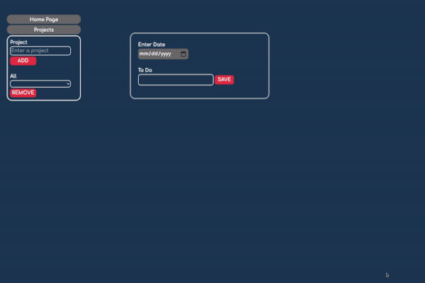

# Task Tracker
---
### [Try the App](https://tttn13.github.io/to-do-list/)

## Background and Overview
---
Task Tracker is a no frills to-do list. Everything is accounted for so you can make progress on the things that are important to you. Simply organize all your to-do’s in projects and mark them when done. The app has a simple UI to ensure quick navigation and avoid clutter. 

## Technologies
---
- Vanilla JavaScript for structure and logic
- Minimal HTML for DOM manipulation and rendering
- CSS for styling
- Webpack to bundle and serve up the various scripts
- localStorage for database

## Key Features
---
##### Quick Entry/Capture 
- Users can quickly add a task with or without the date. Tasks without dates are stored in a section called Misc. 
- Tasks sharing the same deadlines/dates are displayed together in a sub-list on main page.


```
const setToDoView = (todo, todo_id) => {
    const existingDiv = document.getElementById(todo.date) 
    const todosWithSameDate = document.createElement('div')
    //...
    const divContent = setUpViews(todo, todo_id);
    if (existingDiv) {
      existingDiv.appendChild(divContent)
    } else {
      todosWithSameDate.appendChild(divContent)
      document.querySelector("#main").appendChild(todosWithSameDate)
    }
}
```
##### Edit Settings
- Users can edit the todo by clicking the modal box. Settings include editing the text, deleting todo and selecting the project/category that the todo belongs to. 


- Once task is completed users can tick the checkbox. The checked todo will be striked through with dotted outline.  

```
checkBox.checked = all_todos[todoIndex].status;
    if (checkBox.checked) {
      element_container.style.border = "dotted";
      todo_p.style.textDecoration = "line-through #e1304e 3px";
    }
    
checkBox.addEventListener("change", () => {
      all_todos[todoIndex].status = checkBox.checked;
      //...
      }
  persistToStorage();
````
##### Create Projects/Categories
- Users can create projects/categories so they can group relevant tasks together in their respective projects. This will make your todo list much more tidy and organized. If users wish to remove project they can do so by selecting the project in the dropdown and click 'Remove' button.

````
  const updateItemCategory = (modalBox_id, checkBox, project_element) => {
    NewToDo.getTodos()
      .filter((item) => modalBox_id.includes(item.id))
      .forEach((item) => {
        checkBox.checked
          ? (item.category = project_element.innerText)
          : (item.category = "");
      });
````

## Future Development Plans
---
Ver 2.0 is going to be released with significant updates :
- Using React and Redux on the front end. 
- PostgresSQL database is going to be used for persistence on the back end. 
- Multi-tenancy feature would be added to allow users log in and maintain their own task list.  